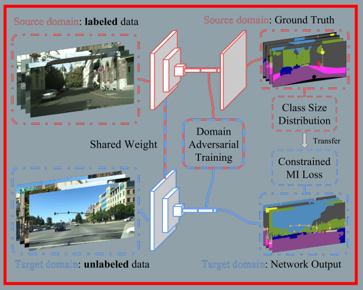

### FCNs in the Wild: Pixel-level Adversarial and Constraint-based Adaptation
###### authors: Stanford Berkeley Princeton
###### data: 2016-12

> FCN models perform well in a supervised setting, but performance can be surprisingly poor under domain shifts that appear mild to a human observer. For example, training on one city and testing on another in a different geographic region and/or weather condition may result in significantly degraded performance due to pixel-level distribution shift.

**This paper introduced the first domain adaptive semantic segmentation method, proposing an unsupervised adversarial approach to pixel prediction problems.**

> Our method consists of both global and category specific adaptation techniques.

> **In this work, we propose the first unsupervised domian adaptation method for transferring semantic segmentation FCNs across image domains. A second contribution of our approach is the combination of global and loacl alignment methods, using global and category specific adaptation techniques that are themselves individually innovative contributions. We align the global statistics of our source and target data using a convolutional domian adversarial training technique, using a novel extension of previous image level classification approaches.**

> Our goal is to learn a semantic segmentation model which is adapted for use on the unlabeled target domian,$T$, with images, $I_T$, but no annotations.

> Global changes may occur between the two domains resulting in a marginal distribution shift of corresponding feature space.
> The second main shift occurs due to category specific parameter chages. This may result from individual categories having specific biases in the two domians.

**The first assumption**
> The source and target domians share the same label space and that the source model achieves performance greater than chance on the target domian.

> We introduce two new semantic segmentation loss objectives, one to minimize the global distribution distance, which operates over both source and target images, $L_{da}(I_S, I_T)$. Another to adapt the category specific parameters using target images and transferring label statistics from the source domian $P_{L_S}$, $L_{mi}(I_T, P_{LS})$. Finally, to ensure that we do not diverge too far from the source solution, which is known to be effective for the final semantic segmentation task, we continue to optimize the standard supervised segmentation objective on the source domian, $L_{seg}(I_S, L_S)$.

$$
L(I_S, L_S, I_T) = L_{seg}(I_S, L_S) + L_{da}(I_S, I_T) + L_{mi}(I_T, P_{L_S})
$$

* Global Domain Alignment
> We seek to minimize the domian shift between representations of the source and target domian. We should comprise an instance within the dense prediction framework, instead, we consider the region corresponding to the natural receptive field of each spatial unit in the final representation layer(*e.g.$f_{c7}$*), as individual instances.

> The second concerning estimating the distance fuction through training a domain classifier to distinguish instances of the source and target domians.
> We then seek to learn a domain classifier to recognize the difference between souce and target regions and use that classifier to guide the distance minimization of the source and target representations.

$$
L_D = -\sum_{I_s\subset S}\sum_{h \subset H} \sum_{w \subset W}\log (p_{\theta_D}(R_{hw}^{S})) - \sum_{I_T\subset T}\sum_{h\subset H}\sum_{w \subset W}\log(1-p_{\theta_D}(R_{hw}^{T}))
$$
**For convenience let us also define the inverse domian loss**
$$
L_{D_{inv}} = -\sum_{I_s\subset S}\sum_{h \subset H} \sum_{w \subset W}\log (1- p_{\theta_D}(R_{hw}^{S})) - \sum_{I_T\subset T}\sum_{h\subset H}\sum_{w \subset W}\log(p_{\theta_D}(R_{hw}^{T}))
$$
$$
\min_{\theta_D} L_D
$$
$$
\min_\theta \frac{1}{2}[L_D + L_{D_{inv}}]
$$
* Category Specific Adaptation
> We consider new constraints which are useful for our pixel-wise unsupervised adaptation problem.**In particular, we begin by computing per image labeling statistics in the source domian, $P_{L_S}$. Specifically, for each source image which contains class c, we compute the percentage of image pixels which have a ground truth label corresponding to this class. We can then compute a histogram over these percentages and denote the lower 10% boundary as, $\alpha_c$, the average value as $\delta_c$, and the upper 10% boundary as $\gamma_c$. We may then use this distribution to inform our target domian size constraints, thereby explicitly transferring scene layout information from the source to the target domian.**
>
$$
p=argmax \phi(\theta, I_T)
$$
$$
\delta_c \leq \sum_{h,w}p_{h,w}(c) \leq \gamma_c
$$

> Thus, our constraint encourages pixels to be assigned to class c such that the percentage of the image labeled with class c is within the expected range observed in the source domain.
