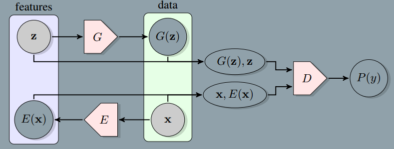

### Adversarial Feature Learning
###### authors: berkeley
###### published: 2017-1
The main ideas of this paper is the same as [Adversarially Learned Inference](gan/Adversarially_Learned_Inference.md).

> Intuitively, models trained to predict these semantic latent representations given data may serve as useful feature representations for auxiliary problems where semantics are relevant.

> We propose Bidirectional Generative Adversarial Networks(BiGANs) as a means of learning this inverse mapping, and demonstrate that the resulting learned feature representation is useful for auxiliary supervised discrimination tasks, competitive with contemporary approaches to unsupervised and self-supervised feature learning.

> BiGAN includes an *encoder E* which maps data x to lantent representations z. The BiGAN discriminator *D* discriminates not only in data space(x versus G(z)), but jointly in data and lantent space(tuples(x, E(x))) versus (G(z), z), where the latent component is either an encoder output $E(x)$ or a generator input z.
