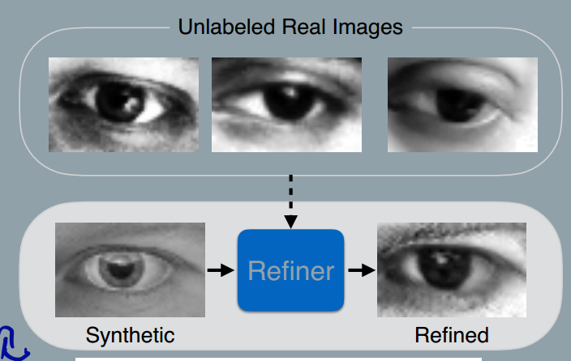
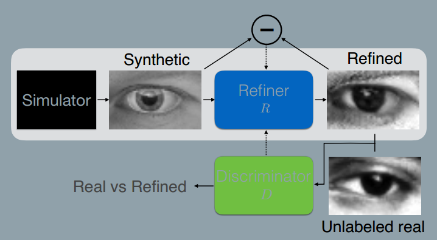
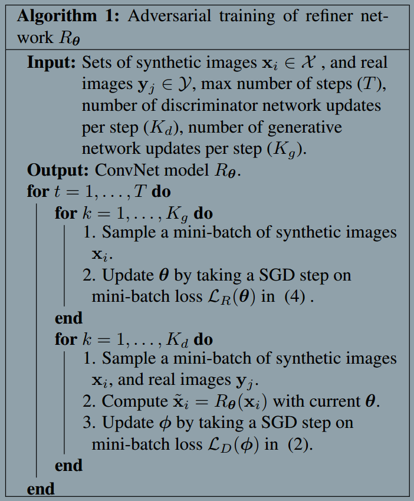
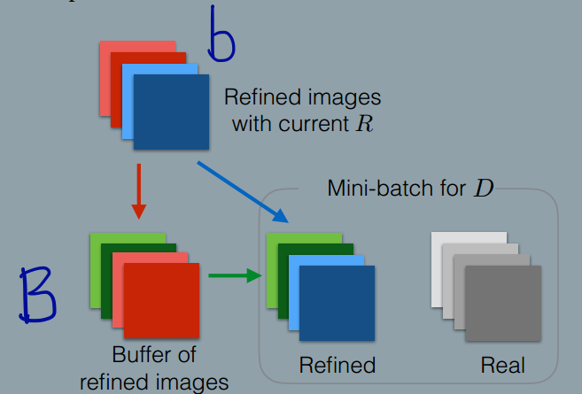

### Learning from Simulated and Unsupervised Images through Adversarial Training
###### published: 2016-12 CVPR 2017 Best Paper
###### authors: Apple Inc

> Learning from synthetic images may not achieve the desired performance due to a gap between synthetic and real image distributions. To reduce this gap, we propose Simulated+Unsupervised(S+U) learning, where the task is to learn a model to improve the realism of a simulator's output using unlabeled real data, while preserving the annotation information from the simulator.

> We make several key modifications to the standard GAN algorithm to preserve annotations, avoid artifacts, and stabilize trainning:
1. a self-regularization term
2. a local adversarial loss
3. updating the discriminator using history of refined images.

**Adversarial Loss with Self-Regularization**

$$
L_R(\theta) = \sum_i l_{real}(\theta; x_i, y) + \lambda l_{reg}(\theta;x_i)
$$

$$
L_D(\phi) = -\sum_i \log(D_{\phi}(\hat{x}_i)) - \sum_j \log(1-D_{\phi}(y_j))
$$

$$
l_{real}(\theta;x_i,y) = -\log(1-D_\phi(R_\theta(x_i)))
$$

$$
L_R(\theta) = -\sum_i \log(1-D_\phi(R_\theta(x_i)))+\lambda||\varphi(R_\theta(x_i))-\varphi(x_i)||_1
$$

**Local Adversarial Loss**

> When we train a single strong discriminator network, the refiner network tends to over-emphiasize certain image features to fool the current discriminator network, leading to drifting and producing artifacts.

> We can define a discriminator network that classifies all local image patches separately. This division not only limits the receptive field, and hence the capacity of the discriminator network, but also provides many samples per image for learning the discriminator network.

**Updating Discriminator using a History of Refined Images**

> Another problem of adversarial training is that the discriminator network only focuses on the latest refined images. This lack of memory may cause:
> 1. divergence of the adversarial training
> 2. the refiner network re-introducing the artifacts that the discriminator has forgotten about.

> We compute the discriminator loss function by sampling $\frac{b}{2}$ images from the current refiner network, and sampling an additional $\frac{b}{2}$ images from the buffer to update parameters $\phi$. After each training iteration, we randomly replace $\frac{b}{2}$ samples in the buffer with the newly generated refined images.
